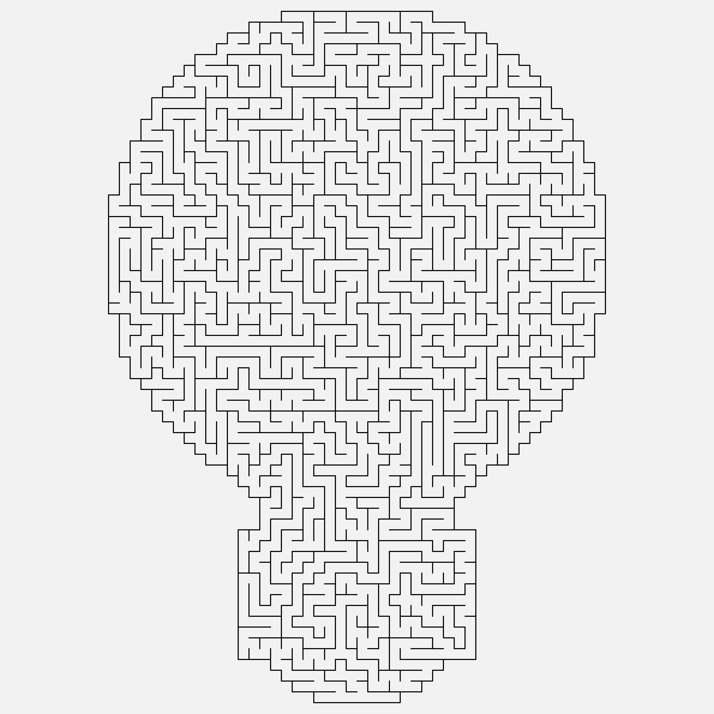
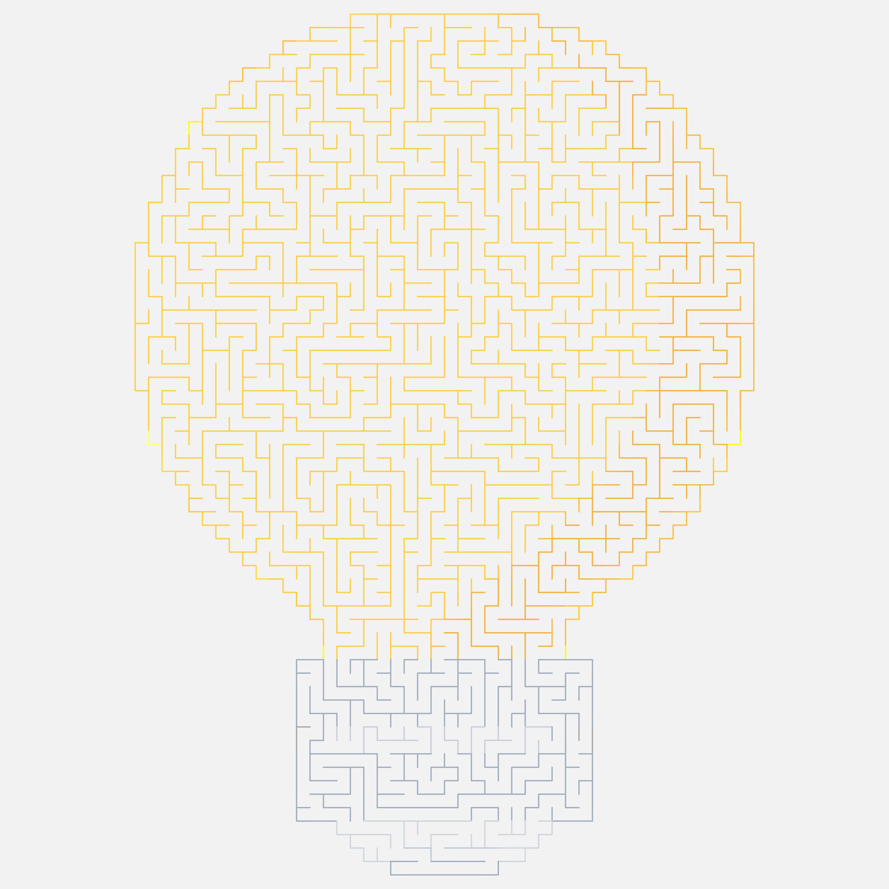
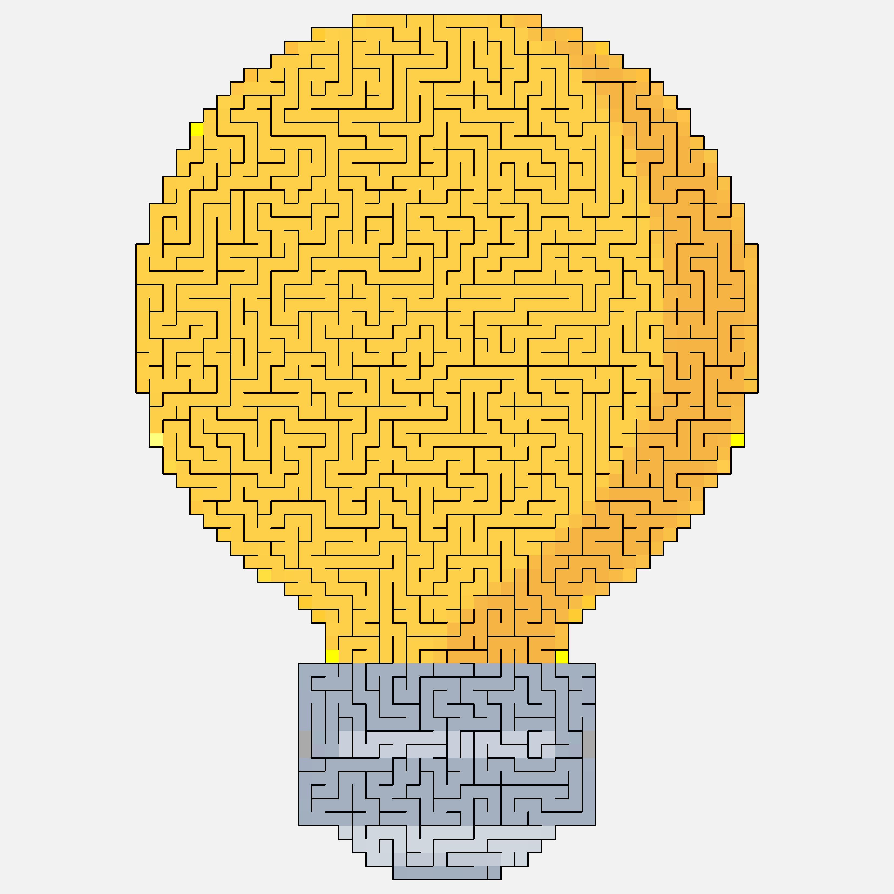

# Image 2 Maze
This is a proof of concept Maze Generation in C#.

It takes an image and creates a maze in the shape of the image.

Although it is based on .net 5 GDI+ methods are used that means it will only run on windows.

## Features:
* Generates Square Mazes
* Generates Images Mazes
* Set wall and background colours or use the image colours
* Set pen and cell render sizes

## Samples

Original Image From: https://www.iconfinder.com/icons/3069195/think_creative_thinking_light_idea_icon

## Next Items Todo
* Add Entrance and Exit to Mazes
* Build UI to expose the options
* Resolve Maze and Render the route
* SVG Render
* Dependency Injection
* Unit Tests